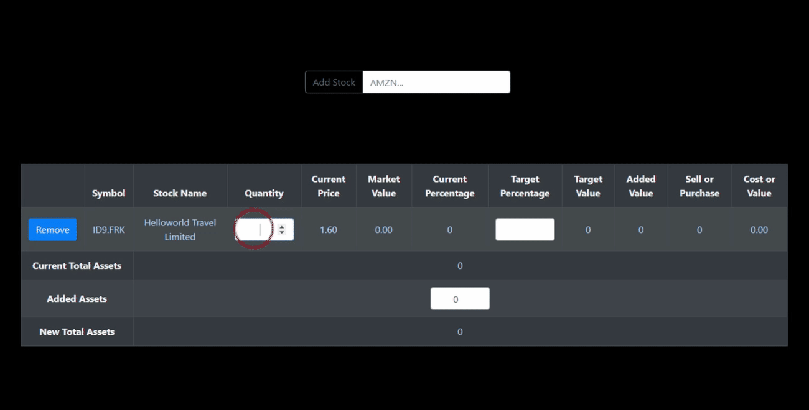
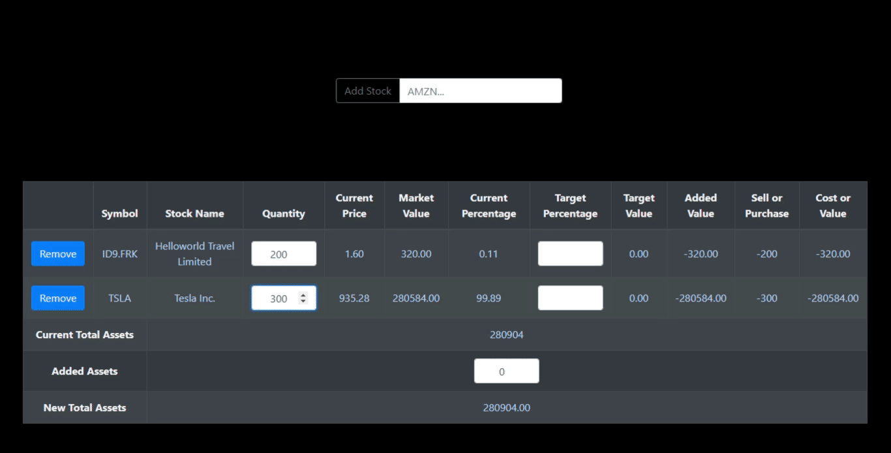
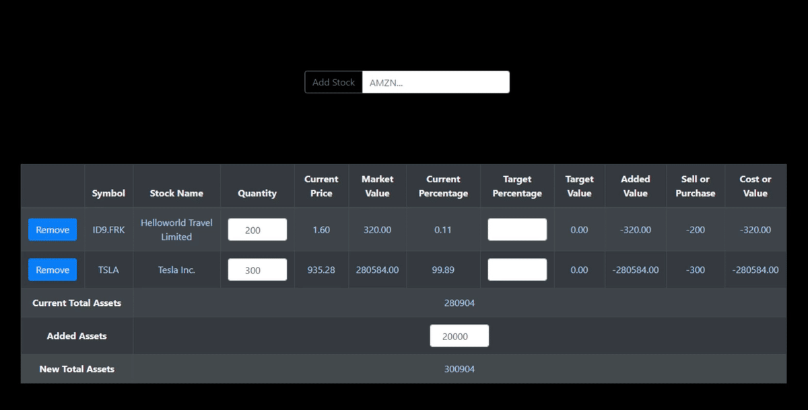
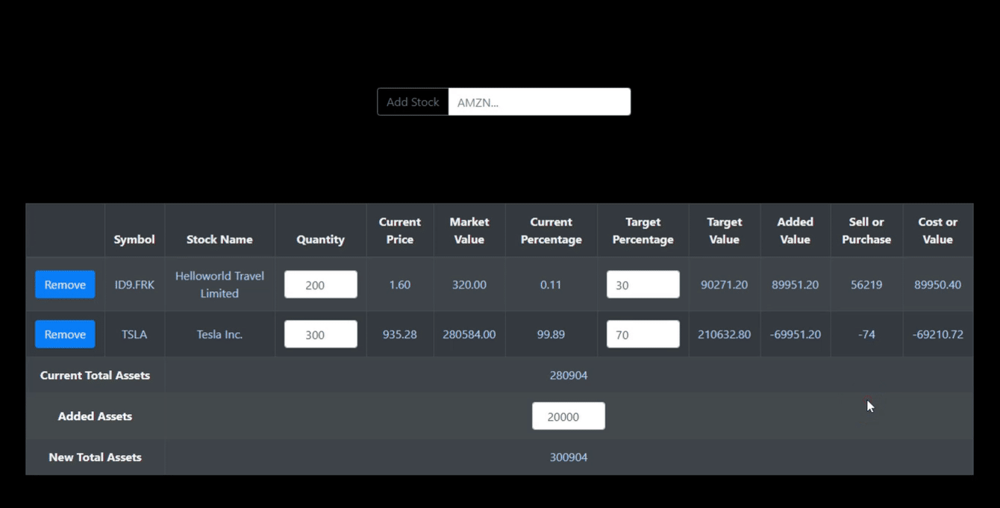

# Rebalance

Rebalance is an app develoed with React.js that helps you re-balance your stock portfolio.

## 1. Add Stock to your Portfolio

Input a stock symbol, company name or keyword into the search bar and click the Add Stock button. Using the Alpha Vantage Search Endpoint API, Rebalance will return the stock that best matches your input. After determining the most appropriate stock associated with your input, the program then uses the Alpha Vantage Global Quote API to return that stock's current price. The stock symbol, stock name, and current price will be added to your portfolio.

## 2. Set Current Percentages

Once a stock has been added to your portfolio, Rebalance allows you to set the current quantity of shares of that stock that you own. When you set the current quantity, the program will automatically calculate the total market value of that stock, the Current Total Asset value of your portfolio, and the current percentage of your portfolio that each stock makes up.

## 3. Add Asset Value

OK, but what if I want to add to my investments? Rebalance allows you to Add Asset value on top of the Current Total Asset value of your portfolio. When you add asset value to your account, the program will calculate your New Total Assets and the target percentages will be that you set for each stock will be based on the New Total Assets.

## 4. Set Target Percentages

Re-balancing a stock portfolio is really only useful to you if you have a target percentage of your portfolio that each stock should make up. Rebalance allows you the Target Percentages of each stock. Once you input a target percentage, the program will then automatically calculate the target value of each stock, the approximate number of shares to purchase of sell in order to get to your target, and the value or cost of that adjustment.

## 5. Remove Stock from Portfolio

Oops, I added the wrong stock to my portfolio! No worries, Rebalance allows you to remove a stock from your portfolio. WHen you remove a stock from your portfolio, the program will automatically adjust your Total Asset values, your current percentages, and your target values accordingly.

